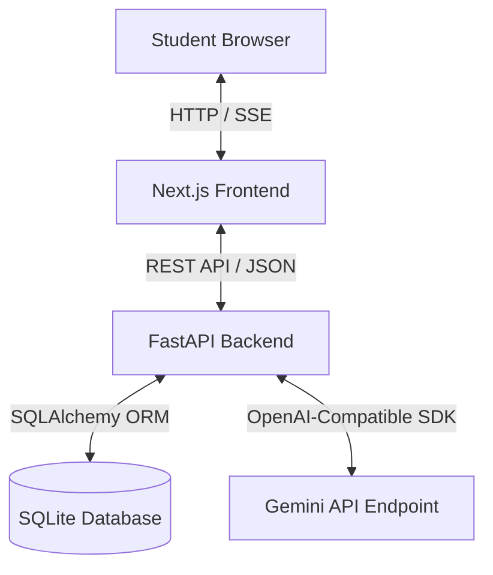
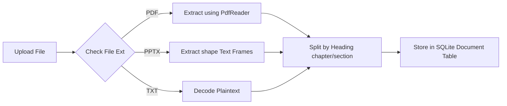
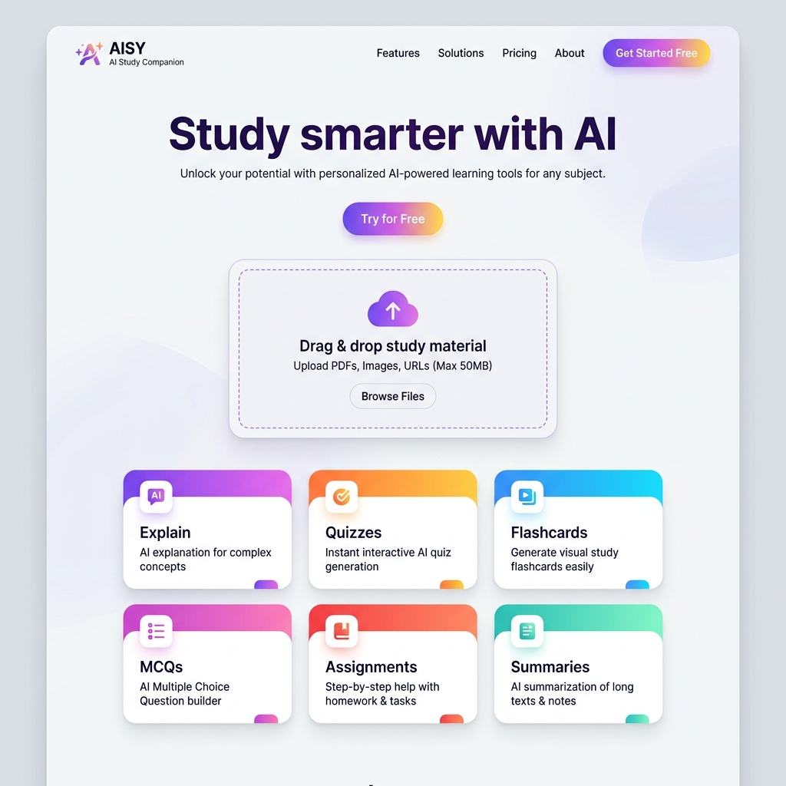
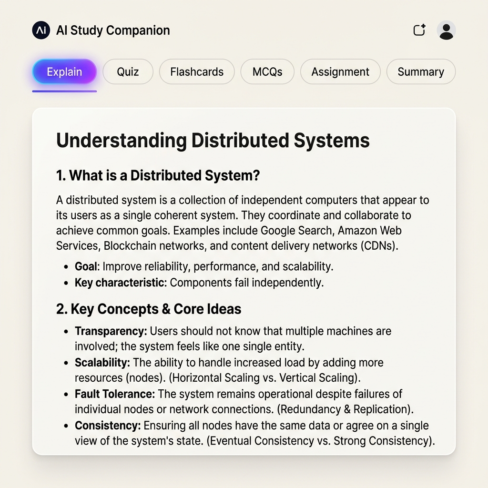
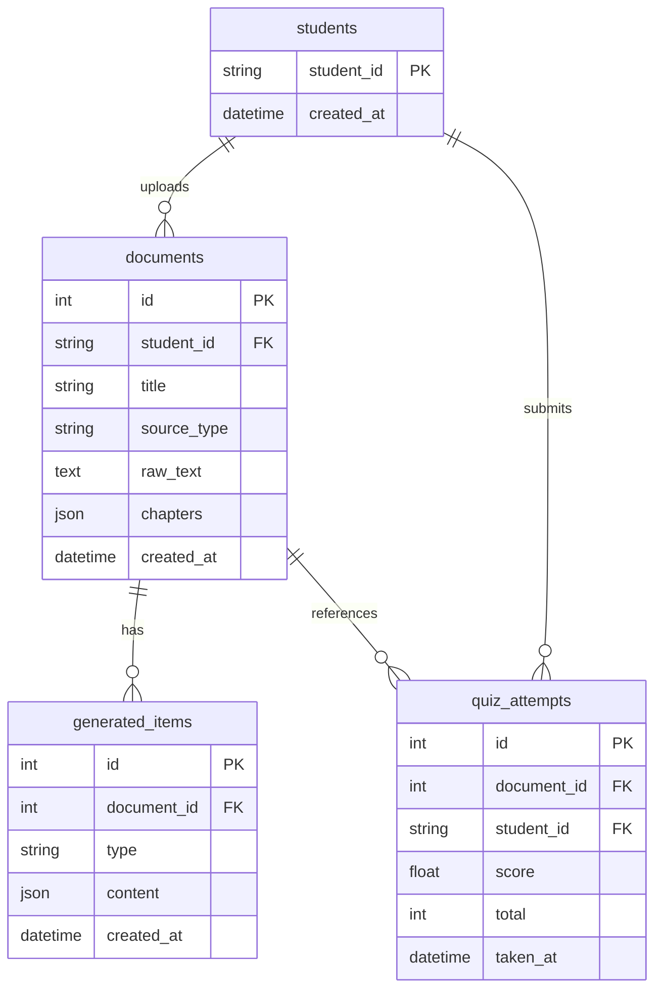

# AI Study Companion: Project Report

An intelligent, full-stack learning assistant application that parses lecture notes and textbooks to automatically generate customized explanations, interactive quizzes, multi-choice questions (MCQs), flashcards, writing assignments, and summarized notes.

---

## Executive Summary

The **AI Study Companion** is a response to the growing need for personalized, active-learning tools. By leveraging state-of-the-art Large Language Models (LLMs), the application transforms passive reading materials (PDFs, PPTX files, text documents) into an interactive study environment. Students receive immediate feedback, track their performance metrics, and engage in cognitive reinforcement exercises (e.g., active recall through flashcards and spaced testing via quizzes).

### Key Features
*   📂 **Multi-Format Text Extraction:** Direct ingestion and text extraction from PDFs (`pypdf`) and PowerPoint slides (`python-pptx`).
*   🧠 **LLM-Powered Study Aids:** Automatic generation of explanations, summaries, quizzes, flashcards, MCQs, and assignments.
*   ⚡ **Real-Time Streaming:** Explanations and summaries stream token-by-token using Server-Sent Events (SSE) for zero-latency user feedback.
*   📊 **Progress Tracking Dashboard:** Visual analytics using interactive charts (`recharts`) monitoring score progression and streak metrics over time.
*   🐳 **Containerized Deployment:** Docker Compose orchestration for unified local development environments.

---

## System Architecture

The application adopts a decoupled, modern multi-tier architecture:
1.  **Frontend:** Next.js (React 19) styled with TailwindCSS, utilizing Recharts for data visualization and SSE clients for text streaming.
2.  **Backend:** FastAPI (Python 3.12) implementing router-based endpoints, database session handlers, and OpenAI-compatible SDK clients.
3.  **Database:** SQLite relational database mapped using SQLAlchemy ORM.

### Architecture Diagram

The system architecture and data flows are represented below:



---

## Technical Details & Component Breakdown

### 1. Backend REST API (FastAPI)
The backend is structured into modular router directories:
*   [documents.py](file:///c:/Users/Lenovo/Desktop/IBM/ai-study-companion/backend/routers/documents.py): Handles multi-part file uploads, invokes extraction engines, and indexes documents by student ID.
*   [generate.py](file:///c:/Users/Lenovo/Desktop/IBM/ai-study-companion/backend/routers/generate.py): Orchestrates calls to the Gemini model API to synthesize study modules.
*   [dashboard.py](file:///c:/Users/Lenovo/Desktop/IBM/ai-study-companion/backend/routers/dashboard.py): Records quiz scores and returns student historical timelines and aggregate statistics.

### 2. Document Processing Pipeline
When a user uploads a document, the system processes it as follows:



### 3. Core AI Integration (Gemini Beta API)
The application connects to Gemini using the standard OpenAI SDK pointing to Gemini's OpenAI-compatible beta endpoint. This allows seamless integration while retaining the capability to enforce strict JSON schemas for quizzes, flashcards, and assignments.

```python
# ai_prompts.py
client = OpenAI(
    api_key=os.getenv("GEMINI_API_KEY"),
    base_url="https://generativelanguage.googleapis.com/v1beta/openai/",
)
MODEL = os.getenv("GEMINI_MODEL", "gemini-3.5-flash")
```

---

## User Interface & Experience

The application is styled with a sleek, minimalist color palette using warm tones (`#FFFBF5` canvas background) paired with vibrant gradient accents representing different study modalities.

### 1. Landing Page & Upload Zone
The main interface features a clean, high-fidelity landing layout with a dashed file drop region and descriptive feature cards indicating system capabilities.



### 2. Performance Dashboard
Students can review their progress via a dedicated dashboard screen. It presents high-level summary cards (total documents, quiz count, average scores) and an interactive score timeline chart.


### 3. Interactive Study Interface
The study console loads documents and partitions tools into tabbed controls. The `Explain` and `Summary` tabs support streaming text generation, while other tabs load interactive components like the `FlashCard` flip decks and the `QuizPlayer`/`MCQPlayer` engines.



---

## Database Schema (Relational Entity Model)

The database schema utilizes SQLite to store student metadata, parsed texts, generated items, and score statistics:



---

## Setup & Local Deployment

### Backend Setup
1. Navigate to the backend folder:
   ```bash
   cd backend
   ```
2. Create and activate a Python virtual environment:
   ```bash
   python -m venv venv
   .\venv\Scripts\activate
   ```
3. Install dependencies:
   ```bash
   pip install -r requirements.txt
   ```
4. Define your Gemini API key in `backend/.env`:
   ```env
   GEMINI_API_KEY="your-api-key"
   GEMINI_MODEL="gemini-3.5-flash"
   ```
5. Run the development server:
   ```bash
   uvicorn main:app --reload --port 8000
   ```

### Frontend Setup
1. Navigate to the frontend folder:
   ```bash
   cd frontend
   ```
2. Install node dependencies:
   ```bash
   npm install
   ```
3. Start the Turbopack hot-reloader:
   ```bash
   npm run dev
   ```
4. Open [http://localhost:3000](http://localhost:3000) in your web browser.

---

## Future Scope & Extensions
*   **Vector Search & RAG (Retrieval-Augmented Generation):** Transition from naive text slicing to vector database search (e.g., Qdrant/Chroma) to handle large textbooks.
*   **Spaced Repetition Integration:** Incorporate SuperMemo-2 (SM-2) algorithms to schedule flashcards dynamically based on active recall difficulty.
*   **PDF Annotation:** Render side-by-side PDFs with interactive highlighting, allowing students to explain specific passages on the fly.
*   **Study Groups:** Real-time web socket communication allowing study buddies to co-author flashcards and compete in live quizzes.
